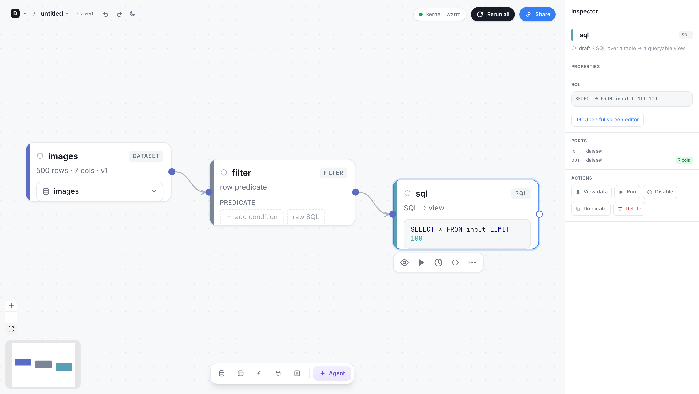
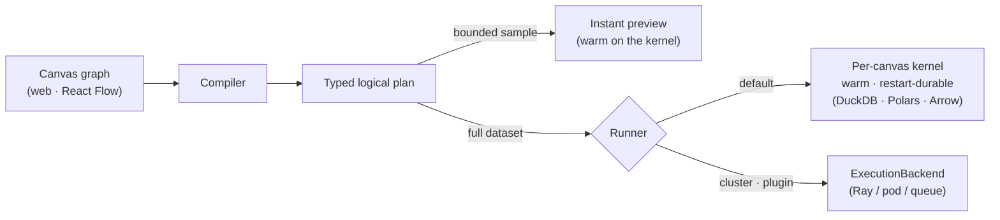
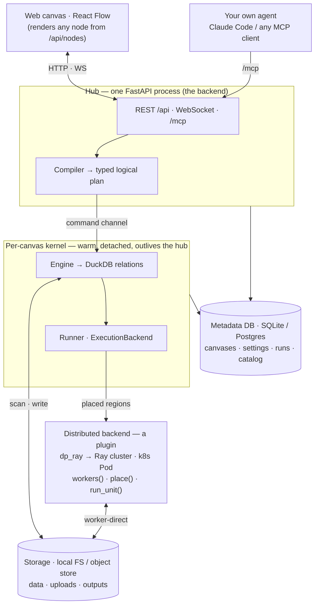

# Data Playground

[](https://github.com/pengw0048/data-playground/actions/workflows/ci.yml)
[](LICENSE)

**Like ComfyUI, but for data.** It's a visual node-graph editor where every wire carries a *typed
table*: connect datasets and operators into a graph, watch the **real rows come out of each step**,
and run the **same graph over the full dataset** — on your laptop, bigger than RAM and all (it streams
from disk instead of loading everything into memory).

Clone it and it works: **no cloud account, no external services, no mock mode.** Point it at your
Parquet / CSV / JSON / Arrow / Lance files and you're doing real data work in five minutes.



## Scope & status

Data Playground is a **local-first visual data workbench** for a **single user or a trusted team**. It
runs fully offline on real data, and a multi-user deployment (auth + Postgres + object storage) is
supported for a **trusted** team — see [Running several instances](#running-several-instances-horizontal-scale-out).
It is **not** a hardened multi-tenant service: the code sandbox is a soft guard (not a security boundary between
mutually-distrusting users), and hard workload isolation is future work — see
[Execution isolation — and its limits](#execution-isolation--and-its-limits). Treat it as a capable
alpha/beta for that scope; don't expose it to untrusted users without the OS-level isolation described
there.

## Quickstart

> **Prereqs:** [uv](https://docs.astral.sh/uv/) and Node 20+ (uv fetches the pinned Python 3.12
> automatically).

```bash
make setup && make run          # → http://127.0.0.1:8471 (seeds sample data on first run)
```

`make setup` installs the `dataplay` command into the local venv, so after that it's one command:

```bash
cd kernel && uv run dataplay                      # serve the canvas + engine, open the browser
cd kernel && uv run dataplay --workspace ./my-proj --port 8471
cd kernel && uv run dataplay run <canvas>         # run a saved canvas to completion, headless (cron/CI)
cd kernel && uv run dataplay run <canvas> --param date=2026-07-12   # bind ${date} in the canvas's configs
```

`dataplay run` executes a saved canvas (by id or unique name) with no browser, prints a per-node
summary (or `--json`), and exits non-zero if the run fails — so a pipeline you built in the canvas
drops straight into cron, CI, or a shell script. It shares the workspace/DB with the web app.
Parameterize a run with `--param NAME=VALUE` (repeatable): any `${NAME}` token in a node's config
(a source uri, a filter predicate, SQL…) is substituted per run; an unbound token fails loudly.

(A *workspace* is just a project directory — it holds your canvases, catalog, outputs, and plugins;
it defaults to the current directory.)

**New here?** Open the file menu → **New from example** for a one-click, runnable starter canvas on the
seeded data, or take the **[5-minute tour](docs/TUTORIAL.md)**: events → keep purchases → total per user → save.

---

## What you get, offline, out of the box

- **Open real data** — Parquet, CSV, JSON, Arrow/Feather, Lance, and directories-of-files. The
  workspace catalog starts as your local files; add more from the **Tables** view — **Register** a path
  already on disk, or **Upload** a file from your machine — or just **drag a file onto the canvas** to
  drop a bound `source` node.
- **A catalog that scales to thousands of tables** — the **Tables** view browses the catalog
  server-side: a **folder tree** (organize datasets into a namespace hierarchy), a **faceted rail**
  (filter by tag / owner, each with live counts), and **search** across name / folder / description /
  columns — all paginated + virtualized, so a catalog of thousands loads a page at a time, never all at
  once. Curate any dataset's **folder, tags, owner, and description** in its detail drawer; sort by name,
  size, recency, or **most-used**. Optional **semantic search** (a drop-in embedder plugin) ranks by
  meaning, not just substring.
- **Explore & transform** — `filter`, `select`, `join`, `aggregate`, `sort`, `dedup`, `window`, `fill`,
  `unnest`, `sql`, `sample`, `metric`, `chart`, `vector-search`, and `transform` (arbitrary Python) nodes
  that **actually execute**.
- **Check the data, not just the shape** — an `assert` node is a data-quality gate: a per-row SQL
  predicate whose output *is* the violating rows (so you see exactly what failed), with `severity=error`
  to fail the run. Pin an **output-schema contract** on a code node — inline, or a named/versioned
  workspace contract many pipelines reference — and `enforce` it to fail the run on schema drift.
- **See your pipeline three ways** — its **shape** (typed nodes and wires on the canvas), its **data**
  (click any node's eye for the real rows + schema flowing out of it on a bounded sample — media
  thumbnails, a vector inspector, charts), and its **execution** (live per-node progress + a stall hint,
  a run panel, failure diagnosis that names the node that broke and suggests a fix, and persisted run
  history with native charts of run duration + per-node time).
- **See how tables relate** — the catalog detects join keys, measures cardinality on real data
  (1:1 / 1:N / N:M), and suggests how two datasets join; declare keys/relationships by hand and view
  them as an ER/UML diagram (scoped to a folder so it stays readable at scale). **Lineage** traces a
  dataset's upstream/downstream datasets (a run records the edges) — a bounded, depth-capped graph, so
  even a densely-connected component stays fast to render.
- **One graph, explore → scale** — the graph you explore with (instant sampled previews) is the *same*
  one you run over the full dataset, with the runner chosen for you — no rewrite. The default engine
  (DuckDB + Polars + Arrow) streams and spills joins/sorts/aggregations to disk, so data bigger than
  RAM doesn't run out of memory.
- **Or don't build it by hand** — point your **own Claude Code** (or any
  [MCP](https://modelcontextprotocol.io) client) at the workspace and
  [watch it build the whole pipeline live in your browser](#drive-it-from-your-own-agent-mcp) — no API
  key, no second process. (Or drive the built-in [agent](#the-agent-optional) with a model you choose.)
- **Extend it with plugins** — drop a Python package in `<workspace>/plugins/` and your typed node
  appears in the Add-node menu, **rendered and wired with no frontend code** (see [Plugins](#plugins--add-a-typed-node-without-touching-the-core)).
- **Save, undo, export** — the canvas is diff-friendly JSON, auto-persisted; `⌘Z`/`⌘⇧Z` undo/redo;
  export a node's rows (JSON/CSV) or the whole canvas.

---

## How it works: a node builds a logical plan

This is the one idea everything else follows from.

A node does **not** run Python row-by-row on the server. Instead it **builds one step of a typed
logical plan**:

- a **relational op** (`filter` / `select` / `join` / `aggregate` / `sort` / `dedup` / `window` / `fill`
  / `unnest` / `assert` / `sql`) becomes a DuckDB relation — pushed down, optimized, and streamed from
  disk; or
- the `transform` escape hatch runs your own Python — and even this isn't row-by-row: it's a
  **batched** function over Arrow `RecordBatch`es, deferred into the same plan and portable to any
  runner. A `map_batches` cell picks how each batch arrives — row dicts (default), a **pandas
  DataFrame**, or a **pyarrow Table** (arrow-native, so column types are preserved).

A **runner** executes that assembled plan. By default it's the canvas's **kernel** — a warm,
restart-durable process (one per canvas, Jupyter-style) running the local engine
(DuckDB · Polars · Arrow) that streams and spills to disk. Because a graph is *just a plan*, the
**same** graph runs three ways with no rewrite: on a small sample for an **instant preview**, over the
**full dataset** (bigger than RAM and all), or — via a cluster runner (a plugin) — across
**many machines**.



Because a wire carries a **typed table** (not raw bytes), the canvas knows every port's schema: it
only lets you connect compatible ports, and the kernel independently re-checks the graph's types
before running it. (Most wires carry a table — a full `dataset` or a bounded `sample`; a `metric` node
instead carries a single computed scalar.)

The port **schema** is resolved metadata-only for a relational op (no data scanned), so you see its
columns before running. A code op (`transform` / a plugin) is untyped until it runs — but you can
**declare** its output columns, or **infer** them from a sample, as a contract that types its port and
everything downstream (Inspector → *Output schema*), or reference a shared named/versioned contract.
Typing is **non-enforcing by default**: if a node's config references a column its input doesn't have,
the node and the wire flag it amber — a hint, never a block, and only when the input schema is actually
known. Opt a contract into `enforce` and it flips to a hard gate — the run fails on schema drift. Cards
also show a conservative **`~N rows`** size estimate before you run.

---

## Architecture — the pieces and how they fit

One **hub** — a single FastAPI process — *is* the backend: it serves the web app (which renders any
node, built-in or plugin, generically from `/api/nodes`), the REST + WebSocket API, and the `/mcp`
endpoint; it checks auth and compiles a canvas graph into a typed logical plan. The hub keeps no
durable state of its own — that lives in a **metadata DB** (canvases, settings, run history, and the
dataset **catalog**; SQLite by default, Postgres via `DP_DATABASE_URL`) and in **storage** (your data,
uploads, and run outputs; the local filesystem by default, an object store via `DP_STORAGE_URL`).

The hub doesn't execute the plan — it hands it to a **kernel**: a warm, detached process, one per
canvas, that outlives the hub so a redeploy never kills an in-flight run. Inside the kernel an
**engine** turns the plan into DuckDB relations and a **runner** executes them — by default the local,
streams-and-spills-to-disk runner, right there. That is the whole default, offline setup. Everything
that changes *what a node does* or *where a plan runs* is a **plugin behind a typed SPI seam** — the
same seam the built-ins go through, so the core never changes:

- **node** (`NodeBuilder`) — a new node kind: its inputs → a DuckDB relation.
- **adapter** (`DatasetAdapter`) — a new format or warehouse: a URI → columnar data (Iceberg, Delta, …).
- **catalog** (`CatalogProvider`) — back the whole catalog with an external metadata service.
- **backend** (`ExecutionBackend`) — *where* a plan runs. A distributed one also implements
  `PlaceableBackend` (`workers()` / `place()` / `run_unit()`), so a run splits into **regions** that are
  each placed on a fitting backend and handed off through shared **storage**. The bundled **`dp_ray`**
  reference backend runs eligible regions on a pinned **Ray 2.56.0 cluster** and writes region outputs
  directly from workers. A startup handshake rejects mixed driver/worker versions, and an explicit
  `engine=ray` pin fails rather than silently falling back when its shape or advertised resources are
  unsupported. Object-store/non-Parquet reads and whole-graph sinks are still driver-funneled today; see
  the [Ray support and readiness matrix](docs/RAY.md). A **`KernelSpawner`** likewise swaps the per-canvas
  kernel from a local process to a **k8s Pod** for cross-host scale.



Both ways of driving the canvas ride on exactly these blocks: the built-in **agent** runs in-process in
the hub, and your **own MCP client** drives the same tools over `/mcp`.

---

## Control flow — a `section` runs a driver script over its nodes

Loops and branches live inside a **`section`**: a composite node whose body is a short **driver
script** (Python) that orchestrates the nodes it contains. The script reads the section's `inputs` and
`params`, executes any contained node with `run(...)` (optionally feeding it a handle and overriding
its config), and uses ordinary `for` / `while` / `if` to decide what runs and how often — pulling a
scalar out with `value(...)`, stacking per-iteration results with `concat(...)`, and returning the
section's output via `emit(...)`. So a retry-until-clean loop, a sweep over parameters, or a branch on
a computed metric is just Python over typed nodes — bounded by a `maxRuns` cap, and inspectable because
every `run(...)` is itself a real, typed step.

---

## Plugins — add a typed node without touching the core

Drop a package in `<workspace>/plugins/<pack>/` (or pip-install one that exposes a `dataplay.plugins`
entry point). It can register nodes, dataset adapters, runners, capabilities, or a catalog:

```python
# plugins/upcase/__init__.py
from hub.sdk import NodeSpec, PortSpec, ParamSpec, ctx, identifier, quote_identifier

SPEC = NodeSpec(kind="upcase", title="uppercase", category="compute",
                inputs=[PortSpec(id="in", wire="dataset")], outputs=[PortSpec(id="out", wire="dataset")],
                params=[ParamSpec(name="column", type="string", default="name")])

def build(engine, node, inputs):                      # contribute one step to the plan
    col = node.data.get("config", {}).get("column", "name")
    column = quote_identifier(identifier(col, inputs[0].columns, label="uppercase column"))
    return ctx.sql(inputs[0], f"SELECT * REPLACE (upper({column}) AS {column}) FROM input")

def register(reg):
    reg.add_node(SPEC, build)
```

Restart the server and `uppercase` is in the Add-node menu — typed, wired, previewable, and runnable,
with no JavaScript written (the frontend rendered it from `/api/nodes`). A complete, tested example
lives in [`examples/plugins/dp_example/`](examples/plugins/dp_example/); **[docs/PLUGINS.md](docs/PLUGINS.md)**
walks through it and the full plugin SPI (also see `kernel/README.md`).

---

## The agent (optional)

The vision is a **data agent that works like a local coding agent** — one that understands *your data*
and *your building blocks* and **creates, debugs, and iterates** on a real pipeline for you. Describe
an outcome and it reads your catalog (columns, keys, how tables join), lays out the flowchart of typed
nodes, writes the `sql` / `transform` code each step needs, **previews the real rows** to check its
work, and fixes and retries when a step is wrong. It's an actor *on* the canvas, not a chatbot beside
it — every node it makes is the same inspectable, typed node you'd wire by hand, so you can take over
at any point (and your own coding agent can drive the canvas the same way over
[MCP](#drive-it-from-your-own-agent-mcp)).

It's **provider-agnostic**: the tool-use loop runs in-process (via [Pydantic AI](https://ai.pydantic.dev)),
so you point it at whatever model you have, and the API key stays in the kernel, never the browser.

```bash
uv pip install -e 'kernel[agent]'     # from a clone

# pick a provider with DP_AGENT_MODEL + its key:
export DP_AGENT_MODEL=anthropic/claude-opus-4-8  && export ANTHROPIC_API_KEY=sk-ant-...  # default
# export DP_AGENT_MODEL=openai/gpt-5             && export OPENAI_API_KEY=sk-...
# export DP_AGENT_MODEL=gemini/gemini-2.5-pro    && export GEMINI_API_KEY=...
# export DP_AGENT_MODEL=ollama/llama3.3          && export DP_AGENT_BASE_URL=http://localhost:11434  # local, no key
```

With no `DP_AGENT_MODEL` set, the dock just shows "Agent unavailable" and everything else works
unchanged — there is deliberately no rule-based stand-in pretending to be an LLM.

---

## Drive it from your own agent (MCP)

The mirror image of the built-in agent: instead of the kernel calling a model, point your **own
Claude Code** (or any [MCP](https://modelcontextprotocol.io) client) at your workspace and have it
build the whole pipeline — explore the catalog, open a canvas, wire typed nodes, **write the
`transform` Python for you**, preview each step against real rows, run it, and read the rows it
produced. No API key required.

The web app **serves the MCP endpoint itself** — connect over HTTP and every tool runs on the app's
real engine and auth (no second process, no drift), and **an edit shows up live in an open browser
tab** (watch the nodes land as the agent wires them):

```bash
cd kernel && uv run dataplay                              # serve the web app
claude mcp add --transport http dataplay http://127.0.0.1:8471/mcp
```

Or run it **standalone over stdio** — no server, stdlib-only — for a headless box or CI:

```bash
claude mcp add dataplay -- uv run dataplay mcp
```

See **[docs/MCP.md](docs/MCP.md)** for both transports, the tool list, and how it fits together.

---

## Keyboard shortcuts

`⌘Z` / `⌘⇧Z` (or `⌘Y`) undo / redo · `⌘A` select all · `⌘C` / `⌘X` / `⌘V` copy / cut / paste ·
`⌘D` duplicate · `Delete` remove · `B` bypass · `D` disable · `Esc` clear selection or close a panel.
Click a node's **output port** to open the connect menu (or drag to wire).

---

## Develop

```bash
make setup     # kernel deps (uv) + sample data + web deps (npm)
make run       # build the web app + serve it with the API on :8471, open the browser
make dev-web   # optional: Vite hot-reload on :5173 (proxies /api → the kernel)
make test      # kernel end-to-end tests (real engine on real files)
make e2e       # browser end-to-end tests (Playwright on the real UI)
```

---

## Running several instances (horizontal scale-out)

One process is the default and is all most people need. This section is about the **web tier** — many
instances behind a load balancer — not about data size (a single instance already handles datasets far
bigger than RAM).

The key fact: no durable state is kept inside a process — it's all in shared stores — so any instance
can serve any request.

- **Metadata** (users, canvases, shares, settings, versions, run history) → the SQL metadata DB.
  Point `DP_DATABASE_URL` at Postgres and every instance shares it.
- **Run status** → mirrored to the DB (`run_states`), so `GET /run/{id}` and the status WebSocket are
  answerable from any instance and survive a restart.
- **Catalog** (registered datasets, written outputs, lineage) → written through to the DB
  (`catalog_entries` / `catalog_edges`), so a dataset registered on one instance is visible to all.
- **The data itself** → object storage (`s3://` / `gs://`); each instance's own DuckDB reads it. This
  is also where **uploads** must land to be shared: set `DP_STORAGE_URL` to an object-store prefix and an
  uploaded file is written there (visible to every instance); left as the default local dir, an upload is
  only readable on the instance that received it — fine single-host, not across a load balancer.

Two *runtime* things still have **instance affinity** — they need routing, not config:

- **Live collaboration** keeps one in-memory room per canvas, so peers editing the same canvas must
  reach the same instance. The canvas id is in the WebSocket path (`/ws/collab/{canvas_id}`), so route
  on the path with a consistent hash — e.g. nginx `hash $uri consistent;` in the `upstream` block.
- **Execution** runs on a per-canvas **kernel** — a detached process that outlives the hub — so a run
  survives the hub restarting or being redeployed, and any instance can report its status (shared via
  `run_states`); a reopened canvas reattaches to a still-running run via `GET /canvas/{id}/active-runs`.
  A single-host hub reaps a canvas's kernel by a heartbeat-gated DB lease; for cross-host, set
  `DP_KERNEL_SPAWNER=pod` (`kernel[pod]`) to run each canvas's kernel as a k8s Pod + Service — a
  reference `KernelSpawner` you verify + tailor to your cluster (RBAC, image, data mounts).

**With Docker.** `Dockerfile` builds one image with the web app baked in; Compose runs that exact image
for both the application and the release migrator against restart-durable Postgres. Set `DP_IMAGE` to
the immutable tag or digest being released and `DP_AUTH_SECRET` to a random signing secret. First boot
requires a transient `DP_AUTH_PASSWORD` so the built-in `local` administrator can log in:

```bash
docker compose up -d postgres
export DP_AUTH_PASSWORD                 # supply it from your secret manager
docker compose run --rm migrate
unset DP_AUTH_PASSWORD
docker compose up -d kernel
```

Later upgrades deliberately trade zero downtime for a simple, safe migration contract. First stop any
MCP, headless, or other writers that run outside this Compose project, then:

```bash
docker compose stop kernel              # stop the Compose-managed application writer
docker compose run --rm migrate          # no DP_AUTH_PASSWORD after an admin credential exists
docker compose up -d kernel
```

Application replicas never run schema DDL. Server, MCP, headless, and kernel processes refuse to start
unless Postgres is already at the build's exact Alembic head, and `/api/readyz` checks the same
contract. Local SQLite still migrates automatically under a lock tied to the resolved database file.
The Compose file also documents volumes, `deploy.replicas`, and sticky routing for multi-instance use;
TLS remains operator-specific (front the service with nginx/Caddy). After first login, create per-user
accounts and rotate passwords in-app; rerunning the migrator never overwrites an existing credential.

---

## Scaling execution — placement & tiered materialization

The section above scales the *web tier*. This is the other axis: running the *compute* of one graph
across more than the local kernel — a heavy step on a cluster, the rest local — without rewriting the
graph. With only the local kernel registered it's all a no-op; it activates when you register a
distributed backend (a plugin).

A run splits into **regions** — maximal runs of adjacent nodes sharing a backend, cut only where they
must (a backend change, a fan-out, or a `checkpoint`). Each region:

- is **placed** by a cost estimate. A per-node, bottom-up size estimate — conservative (it never
  under-estimates; it reports "unknown" rather than guessing a number) — decides whether a region's
  working set fits the local kernel's memory (`DP_MEMORY_LIMIT` / `DP_KERNEL_MEM`, default 4 GB) or
  wants a bigger backend. A manual `config.requires` (cpu / gpu / mem / labels) is an authoritative pin.
- **hands off** through a **storage tier**: a boundary materializes to the cheapest tier both the
  producing and consuming backend can reach — local disk for a local→local handoff, a shared object
  store (`DP_STORAGE_URL`) when a remote backend is involved (so *not every handoff writes S3*). If a
  later run needs the result on a different tier, it's copied, not recomputed.

The **run-plan preview** (a node's Inspector → *Run plan*) shows this before you run — the regions,
each region's backend, its handoff tier, and its estimated rows — plus two **pre-flight** checks: a
resource need no backend can satisfy is flagged with what *is* available ("needs 4×a100 — backends
advertise: 2×a100", from each backend's `workers()` capacity), and an object-store source with a huge
fragment count or cold-tier (Glacier) objects is flagged before a full run hangs or OOMs on it. It
appears only when placement splits/routes or a pre-flight warns; a plain local graph just shows its
`~N rows` estimate on the card. Confirmation gates on estimated **data volume** (bytes, not just row
count). A distributed backend that reports per-step progress also drives the live progress bar + stall
hint — no fabricated ETA.

**Adding a distributed backend is a plugin.** Implement the `ExecutionBackend` protocol, plus the
optional `PlaceableBackend` — `workers()` / `place(requires)` / `run_unit(graph, output_node, output_uri)`
/ `reachable_tiers()`. `run_unit` runs one region reading its input from a tier URI and writing its
output to a tier URI; a production backend should keep both paths worker-direct. The bundled **`dp_ray`**
plugin is the working reference: it proves real Ray Data region dispatch and worker-direct Parquet shard
outputs, while same-host local Parquet may also be read directly. Object-store/non-Parquet inputs and
Popen compatibility sink paths currently pass through the driver. Ray Jobs instead supports one narrow,
worker-direct, managed Parquet overwrite sink and rejects other sink contracts before submission, so use
the [documented support boundary](docs/RAY.md) rather than treating the validation harness as a production
deployment. The plugin keeps its local Popen driver for development and optionally adds a
restart-reattachable Ray Jobs control-plane lifecycle for whole-graph runs, with persisted cancel intent
and atomic terminal SQL publication; see
**[Durable Ray Jobs execution](docs/RAY_JOBS.md)**.

---

## Execution isolation — and its limits

Every canvas runs on its own **kernel** — a separate, long-lived OS process — so a user's arbitrary
Python (transform / section scripts) can't crash, hang, or OOM the hub or another canvas, and a
wedged kernel is restartable (Settings → Execution → **Restart kernel**) without losing your other
canvases. Paired with `DP_DATASET_ROOTS`, filesystem access is confined to the allowed roots by
DuckDB's native sandbox — uniformly, including raw `sql` (`read_csv` / `COPY` can't escape) — as long
as no object store is configured (object storage needs network access, which the sandbox disables, so
the two are mutually exclusive).

**This is crash/DoS isolation, not a multi-tenant jail.** A kernel still runs as the **same OS user on
the same filesystem**, and the code "sandbox" is a soft guard, not a security boundary. And a kernel
is per-*canvas*: collaborators editing a **shared** canvas share one kernel, so a runaway transform
there can wedge a co-editor's runs (a restart clears it). Real tenant isolation needs OS-level
sandboxing — containers, per-user accounts, or a pod-per-canvas `ExecutionBackend` plugin. (The
in-process and subprocess runners stay selectable in Settings → Execution.)

**Credentials in the kernel.** Because the kernel *is* the data engine, it necessarily holds the
metadata-DB and object-store credentials — canvas code can read them, so treat those as available to
anyone who can run a canvas. It does **not** receive the session-signing secret (`DP_AUTH_SECRET`): the
kernel authenticates its own channel with a per-kernel token, so a canvas can't forge login sessions.
Once auth is on (`DP_AUTH_SECRET` set), **per-canvas pip installs default OFF** — arbitrary installs +
network egress don't belong in a shared deployment; ship a pre-baked image, or opt back in explicitly
with `DP_CANVAS_PIP_DEPS=1`.

---

## Contributing

Bug reports, plugin ideas, and PRs are welcome — see [CONTRIBUTING.md](.github/CONTRIBUTING.md) for
the dev loop and how to add a plugin, and [SECURITY.md](.github/SECURITY.md) to report a
vulnerability privately. The core stays provider-agnostic and offline-first; vendor-specific work
lives behind a plugin seam.

---

## License

Apache-2.0 — permissive, for adoption and commercial embedding. The engine dependencies (DuckDB,
Polars, Arrow, Lance) are all MIT/Apache/BSD. Organization-specific backends (a managed catalog, a
cluster runner, private model pipelines) are an optional plugin pack, never a dependency of the core.
