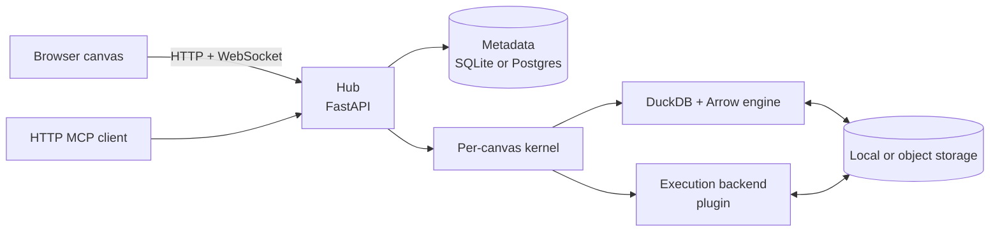

# Data Playground

[](https://github.com/pengw0048/data-playground/actions/workflows/ci.yml)
[](LICENSE)

**Build data pipelines as typed graphs, and inspect real data as you go.**

Data Playground is a local-first visual workbench for data. Connect sources and operations on a
canvas, inspect rows and schemas throughout the graph, then run the same graph over the full
dataset or from the command line.

The default setup needs no cloud account, hosted service, or model. Point it at Parquet, CSV, JSON,
Arrow/Feather, Lance, or a directory of files and start working with real data.


> [!NOTE]
> Data Playground is pre-1.0 and built for a single user or a trusted team. It is not a hardened
> multi-tenant service. This README describes capabilities available on `main`, not unmerged work.

## Quick start

You need [uv](https://docs.astral.sh/uv/) and [Node.js 20+](https://nodejs.org/). `uv` installs the
pinned Python version and Python dependencies.

```bash
git clone https://github.com/pengw0048/data-playground.git
cd data-playground
make setup
make run
```

Open <http://127.0.0.1:8471>, then choose **New from example** for a runnable starter canvas or follow
the [5-minute tour](docs/TUTORIAL.md).

`make setup` is a one-time step. To launch a different workspace later:

```bash
cd kernel
uv run dataplay --workspace /path/to/workspace
```

A workspace contains canvases, metadata, outputs, and drop-in plugins. Its `data/` directory is scanned
automatically; other allowed paths can be registered from the Tables view.

### Run a saved canvas headlessly

The graph built in the browser is also a command-line pipeline:

```bash
cd kernel
uv run dataplay run <canvas-id-or-name> --workspace /path/to/workspace
uv run dataplay run <canvas-id-or-name> --workspace /path/to/workspace \
  --param date=2026-07-13 --json
```

When pointed at the same workspace, `dataplay run` shares its canvases, metadata, and engine with the
web app. It exits non-zero on failure, supports repeatable `${NAME}` parameters, and can target one node
with `--node`. This makes a canvas usable from cron, CI, or an external orchestrator without converting
it into a second pipeline definition.

## What it does

| Area | Current capability |
| --- | --- |
| **Build** | Typed ports and validated connections on a React Flow canvas; autosave, versions, undo/redo, sections, sharing, and Yjs live collaboration |
| **Inspect** | Bounded real-row previews, schemas, profiles, media cells, charts, row export, and per-node errors; operations that cannot be sampled truthfully request a full pass |
| **Transform** | Relational filtering, projection, joins, unions, pivots, aggregates, sorting, deduplication, windows, null filling, unnesting, SQL, and Python transforms fed from Arrow batches in row, pandas, or PyArrow modes |
| **Validate** | Schema-aware column warnings, row-level assertions that expose violating rows, and named/versioned schema contracts that can fail a run on drift |
| **Discover** | Server-paginated catalog browse, folders, facets, lexical search, optional semantic search, keys, join suggestions, relationships, and bounded lineage |
| **Execute** | Local DuckDB execution that streams and spills relational work, warm per-canvas kernels, progress, cancellation, persisted run history, and headless runs |
| **Extend** | Public Python ports for nodes, datasets, catalogs, search, destinations, importers, viewers, telemetry, kernel substrates, and execution backends |

Preview and full execution intentionally share the same node-building path. A preview bounds source
reads only when that preserves the operation's meaning; a write, global aggregate, or other full-pass
operation says so instead of returning a misleading sample.

## How it works



- The **browser** renders built-in and plugin nodes from the same node schemas exposed by the API.
- The **hub** serves the SPA, REST API, WebSockets, and MCP endpoint; it authenticates requests,
  persists workspace state, and compiles graphs.
- A warm **kernel** per canvas owns execution. A detached local kernel can outlive a hub-process
  restart on the same host. The default engine builds lazy DuckDB relations; custom Python is fed from
  Arrow batches and can operate in row, pandas, or PyArrow mode.
- Durable state lives in the **metadata database** and **storage**. SQLite and the local filesystem are
  the zero-configuration defaults; Postgres and object storage support shared deployments.
- Collaboration rooms are process-local, so a multi-instance deployment must route one canvas's
  WebSocket peers to the same hub instance.

Headless runs and stdio MCP initialize the same graph and execution core directly rather than calling
the HTTP hub.

The architecture and execution details are documented in [`kernel/README.md`](kernel/README.md).

## Extend and integrate

A plugin is a Python package with a `register(reg)` entry point. Drop one into
`<workspace>/plugins/`, install a package exposing a `dataplay.plugins` entry point, or load a module
with `DP_PLUGINS`.

| Port | Use it to connect |
| --- | --- |
| `NodeSpec` + `NodeBuilder` | A typed operation rendered by the existing frontend |
| `DatasetAdapter` | A file format, table format, warehouse, or data service |
| `CatalogProvider` | An external catalog, namespace, lineage, or catalog-search implementation |
| `ExecutionBackend` / `PlaceableBackend` | A queue, scheduler, cluster, or other compute plane |
| `KernelSpawner` | Another per-canvas runtime substrate, such as Kubernetes Pods |
| Registry hooks | Destinations, pipeline importers, embedders, viewers, processors, managed-object providers, and telemetry sinks |

These ports are also the intended boundary for external services: keep catalog/search, scheduling, and
compute-specific clients in optional adapter packages while the open-source core remains offline-first
and provider-agnostic. Identity and policy integrations should extend generic contracts instead of adding
provider-specific branches to core. A typed plugin node is rendered and wired without custom frontend
code.

Start with the [plugin guide](docs/PLUGINS.md) and the tested reference packages in
[`examples/plugins/`](examples/plugins/).

## Agents and automation

Data Playground does not require an LLM. Two optional paths operate on the same canvases and execution
engine:

- **MCP:** connect Claude Code or another MCP client to list data, build and validate graphs, preview
  steps, start runs, and read results. HTTP MCP updates an open local canvas live; authenticated
  deployments currently use the stdio transport. See [docs/MCP.md](docs/MCP.md).
- **Built-in agent:** configure a supported model to let the in-app agent inspect the catalog, edit a
  graph, write transforms, and preview its work.

With the local app running, an MCP client can connect over HTTP:

```bash
claude mcp add --transport http dataplay http://127.0.0.1:8471/mcp
```

> [!IMPORTANT]
> Agent tools expose catalog metadata and real preview rows. Treat either the built-in agent or an MCP
> client backed by a hosted model as data egress; use a provider and policy appropriate for the data,
> or keep those integrations disabled.

## Project status and security boundary

| Deployment profile | Status |
| --- | --- |
| **Local, single user or fully trusted collaborators** | Primary path; runs offline with SQLite and local storage |
| **Trusted-team shared service** | Auth, Postgres, object storage, shared run state, and PodSpawner building blocks exist; operators still own TLS, secrets, IAM, backups, network policy, quotas, and topology validation |
| **Ray execution** | `dp_ray` is a tested reference backend for the exact shapes in [docs/RAY.md](docs/RAY.md). On current `main`, it does not have a restart-durable Ray job lifecycle, and the Compose/KubeRay files are validation harnesses rather than production manifests |
| **Mutually distrusting tenants** | Not supported |

Python transforms, section scripts, installed plugins, and per-canvas dependencies execute as the
kernel's OS user. `DP_DATASET_ROOTS` constrains supported file access, and user SQL has a fail-closed
policy, but neither turns arbitrary Python into a security boundary. A kernel also holds the data and
metadata credentials needed to execute its canvas.

Canvas sharing is not dataset isolation: the catalog and data engine are workspace-wide. Settings that
hold credentials (`agentApiKey`, object-store access keys / session tokens, and plugin `[[config]]`
fields marked `secret`) store a **secret reference** — `env:VAR_NAME` or `file:/path/to/secret` — never
the secret itself. The hub resolves references only in the process that needs the capability (agent call,
object-store client, plugin registration). A pluggable `SecretResolver` seam (`hub.secrets` /
`reg.add_secret_resolver`) lets a future plugin add schemes such as Vault without importing a vendor
client into core.

After upgrading, run `dataplay migrate`: any legacy plaintext secret values are **deleted** (not
converted). Re-enter each affected setting as a reference. Example:

```text
agentApiKey                          = env:ANTHROPIC_API_KEY
objectStore.accessKeyId              = env:AWS_ACCESS_KEY_ID
objectStore.secretAccessKey          = env:AWS_SECRET_ACCESS_KEY
objectStore.sessionToken             = env:AWS_SESSION_TOKEN   # optional
plugin.<pack>.<secret-field>         = file:/run/secrets/pack_token
```

Leave credential fields blank to fall back to the process environment / instance role. Protect metadata
backups accordingly; they now contain references, not credentials.

Run only trusted canvases and plugins. See the [security policy](.github/SECURITY.md) for the exact
boundary and private vulnerability-reporting path.

### Docker reference setup

The Compose file is an authenticated, Postgres-backed reference setup. It deliberately separates the
release migration from application startup. Export every required secret first — Compose fails closed
if `DP_AUTH_SECRET` or `DP_POSTGRES_PASSWORD` is unset:

```bash
export DP_AUTH_SECRET="$(openssl rand -hex 32)"
export DP_POSTGRES_PASSWORD="$(openssl rand -hex 32)"
export DP_AUTH_PASSWORD="choose-an-initial-password"

docker compose build
docker compose up -d postgres
docker compose run --rm migrate
unset DP_AUTH_PASSWORD
docker compose up -d kernel
```

Sign in as `local` with the bootstrap password. Keep `DP_AUTH_SECRET` and `DP_POSTGRES_PASSWORD`
stable across restarts. Before a later migration, stop every process that writes the metadata
database. The [Kubernetes reference](deploy/README.md) documents that release contract, the
PodSpawner validation path, and what must be adapted for a real deployment.

### Deployment modes

`DP_DEPLOYMENT_MODE` selects how strict the hub is about transport settings:

| Mode | When to use | Startup behavior |
| --- | --- | --- |
| `local` (default) | Laptop / zero-config HTTP on loopback | Unchanged: plain HTTP works; `dp_session` stays `HttpOnly` + `SameSite=Lax` without `Secure` unless you opt in |
| `shared` | Multi-user service behind TLS | Fails before binding if auth, Secure cookies, or a transport declaration is missing |

Shared mode requires all of:

1. `DP_AUTH_SECRET` — signed session cookies (already required by Compose)
2. `DP_AUTH_SECURE_COOKIE=1` — browsers will only send `dp_session` over HTTPS
3. Either `DP_AUTH_DIRECT_TLS=1` (TLS terminates at the hub process) or
   `DP_TRUSTED_PROXIES=<proxy-ip>[,...]` (TLS terminates at those reverse proxies; only they may set
   `X-Forwarded-For` / `X-Forwarded-Proto` used for login rate limiting)

Unset mode keeps today's localhost defaults. The Compose reference sets `shared` with Secure cookies and
`DP_AUTH_DIRECT_TLS=1`; swap in `DP_TRUSTED_PROXIES` when a proxy terminates TLS instead.

## Documentation

| Guide | Use it for |
| --- | --- |
| [5-minute tour](docs/TUTORIAL.md) | Build and run a first pipeline on the seeded data |
| [Browser and viewport support](docs/BROWSER_SUPPORT.md) | Desktop-first scope, minimum viewport, tested browsers, and input model |
| [Catalog](docs/CATALOG.md) | Browse, search, curate, and integrate catalog and lineage data |
| [Plugins](docs/PLUGINS.md) | Add nodes or connect another data, catalog, destination, or execution system |
| [MCP](docs/MCP.md) | Connect an external agent over HTTP or stdio |
| [Ray](docs/RAY.md) | Exact distributed support matrix, validation evidence, and production gates |
| [Kubernetes reference](deploy/README.md) | Validate and adapt the per-canvas Pod substrate |
| [Contributing](.github/CONTRIBUTING.md) | Development loop, tests, and plugin contribution guidelines |
| [Security policy](.github/SECURITY.md) | Trust boundary and private vulnerability reporting |

The workbench is desktop-first (minimum **1280×720**, Chromium tested in CI, keyboard + mouse). See
[browser and viewport support](docs/BROWSER_SUPPORT.md) for the full statement.

## Development

Run the backend and Vite development server in separate terminals:

```bash
make dev-kernel   # API on :8471
make dev-web      # app on :5173, proxying the API
```

Run the relevant checks before opening a pull request:

```bash
make test
(cd web && npm test && npm run build)
make e2e-install  # one-time browser install
make e2e
```

CI also owns the PostgreSQL migration contract and path-gated multi-node Ray validation. See
[CONTRIBUTING.md](.github/CONTRIBUTING.md) for the clean-environment commands.

## Contributing

Bug reports, plugin ideas, and focused pull requests are welcome. Keep the core offline-first and put
provider-specific behavior behind a plugin port. Report security issues privately through the process
in [SECURITY.md](.github/SECURITY.md).

## License

[Apache License 2.0](LICENSE)
