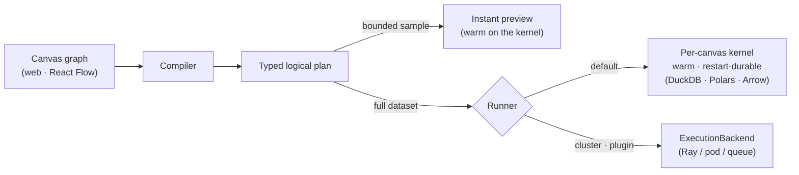

# Data Playground

**Like ComfyUI, but for data.** It's a visual node-graph editor where every wire carries a *typed
table*: connect datasets and operators into a graph, watch the **real rows come out of each step**,
and run the **same graph over the full dataset** — out-of-core on your laptop, bigger-than-RAM and all.

Clone it and it works: **no cloud account, no external services, no mock mode.** Point it at your
Parquet / CSV / JSON / Arrow / Lance files and you're doing real data work in five minutes.


## Quickstart

> **Prereqs:** [uv](https://docs.astral.sh/uv/) and Node 20+ (uv fetches the pinned Python 3.12
> automatically).

```bash
make setup && make run          # → http://127.0.0.1:8471 (seeds sample data on first run)
```

`make setup` installs the `dataplay` command into the local venv, so after that it's one command:

```bash
cd kernel && uv run dataplay                      # serve the canvas + engine, open the browser
cd kernel && uv run dataplay --workspace ./my-proj --port 8471
```

(A *workspace* is just a project directory — it holds your canvases, catalog, outputs, and plugins;
it defaults to the current directory.)

**New here?** The **[5-minute tour](docs/TUTORIAL.md)** builds a real pipeline on the seeded data:
events → keep purchases → total per user → save.

---

## What you get, offline, out of the box

- **Open real data** — Parquet, CSV, JSON, Arrow/Feather, Lance, and directories-of-files. The
  workspace catalog starts as your local files; add more by registering a path (`POST /api/catalog/register`
  or a `source` node), or **upload a file** — drag it onto the canvas to drop a bound `source` node, or use
  the Upload button in a source node / the Tables view.
- **Explore & transform** — `filter`, `select`, `join`, `aggregate`, `sort`, `dedup`, `sql`, `sample`,
  `metric`, `chart`, `vector-search`, and `transform` (arbitrary Python) nodes that **actually execute**.
- **See your pipeline three ways** — its **shape** (typed nodes and wires on the canvas), its **data**
  (click any node's eye for the real rows + schema flowing out of it on a bounded sample — media
  thumbnails, a vector inspector, charts), and its **execution** (per-node run state, a run panel, and
  persisted run history).
- **See how tables relate** — the catalog detects join keys, measures cardinality on real data
  (1:1 / 1:N / N:M), and suggests how two datasets join; declare keys/relationships by hand and view
  them as an ER/UML diagram.
- **One graph, explore → scale** — the graph you explore with (instant sampled previews) is the *same*
  one you run over the full dataset, out-of-core, with the runner chosen for you — no rewrite. The
  default engine (DuckDB + Polars + Arrow) spills joins/sorts/aggregations to disk, so data bigger than
  RAM doesn't OOM.
- **Extend it with plugins** — drop a Python package in `<workspace>/plugins/` and your typed node
  appears in the Add-node menu, **rendered and wired with no frontend code** (see [Plugins](#plugins--add-a-typed-node-without-touching-the-core)).
- **Save, undo, export** — the canvas is diff-friendly JSON, auto-persisted; `⌘Z`/`⌘⇧Z` undo/redo;
  export a node's rows (JSON/CSV) or the whole canvas.

---

## How it works: a node builds a logical plan

This is the one idea everything else follows from.

A node does **not** run Python row-by-row on the server. Instead it **builds one step of a typed
logical plan**:

- a **relational op** (`filter` / `select` / `join` / `aggregate` / `sort` / `dedup` / `sql`) becomes a
  DuckDB relation — pushed down, optimized, and out-of-core; or
- the `transform` escape hatch runs your own Python — and even this isn't row-by-row: it's a
  **batched** function over Arrow `RecordBatch`es, deferred into the same plan and portable to any
  runner. A `map_batches` cell picks how each batch arrives — row dicts (default), a **pandas
  DataFrame**, or a **pyarrow Table** (arrow-native, so column types are preserved).

A **runner** executes that assembled plan. By default it's the canvas's **kernel** — a warm,
restart-durable process (one per canvas, Jupyter-style) running the local out-of-core engine
(DuckDB · Polars · Arrow). Because a graph is *just a plan*, the **same** graph runs three ways with no
rewrite: on a small sample for an **instant preview**, over the **full dataset** out-of-core, or — via
a cluster runner (a plugin) — across **many machines**.



Because a wire carries a **typed table** (not raw bytes), the canvas knows every port's schema: it
only lets you connect compatible ports, and the kernel independently re-checks the graph's types
before running it. (Besides a full `dataset`, a wire can carry a `sample`, a column `selection`, or a
computed `metric` / `value`.)

The port **schema** is resolved metadata-only for a relational op (no data scanned), so you see its
columns before running. A code op (`transform` / a plugin) is untyped until it runs — but you can
**declare** its output columns, or **infer** them from a sample, as a contract that types its port and
everything downstream (Inspector → *Output schema*). It's a **non-enforcing** type system: if a node's
config references a column its input doesn't have, the node and the wire flag it amber — a hint, never a
block, and only when the input schema is actually known. Cards also show a conservative **`~N rows`**
size estimate before you run.

---

## Architecture (one process)

```
web/     React + React Flow + zustand — the canvas: node cards, typed wires, and panels
         (data / run / history / code / lineage) plus the agent dock. It renders ANY node —
         built-in or plugin — generically from the /api/nodes schema, so a new node type
         needs no frontend code.

kernel/  The `hub` package: one FastAPI server that serves the web app, the API, the WebSockets,
         and the engine. A graph is compiled to a logical plan; by default it runs on the canvas's
         own kernel — a warm, restart-durable process running the local out-of-core engine
         (DuckDB · Polars · Arrow). Everything else specific is a plugin.
```

---

## Control flow — sections, not branch/loop nodes

There are no `branch` / `loop` / `variable` node types. Control flow lives inside a **`section`**: a
composite node whose body is a small **driver script** (Python) that calls the nodes inside it with
real `for` / `while` / `if` and an `emit(...)` for its output. Iteration and branching are just code
over typed nodes — bounded and inspectable.

---

## Plugins — add a typed node without touching the core

Drop a package in `<workspace>/plugins/<pack>/` (or pip-install one that exposes a `dataplay.plugins`
entry point). It can register nodes, dataset adapters, runners, capabilities, or a catalog:

```python
# plugins/upcase/__init__.py
from hub.sdk import NodeSpec, PortSpec, ParamSpec, ctx

SPEC = NodeSpec(kind="upcase", title="uppercase", category="compute",
                inputs=[PortSpec(id="in", wire="dataset")], outputs=[PortSpec(id="out", wire="dataset")],
                params=[ParamSpec(name="column", type="string", default="name")])

def build(engine, node, inputs):                      # contribute one step to the plan
    col = node.data.get("config", {}).get("column", "name")
    return ctx.sql(inputs[0], f'SELECT * REPLACE (upper("{col}") AS "{col}") FROM {{input}}')

def register(reg):
    reg.add_node(SPEC, build)
```

Restart the server and `uppercase` is in the Add-node menu — typed, wired, previewable, and runnable,
with no JavaScript written (the frontend rendered it from `/api/nodes`). A complete, tested example
lives in [`examples/plugins/dp_example/`](examples/plugins/dp_example/); **[docs/PLUGINS.md](docs/PLUGINS.md)**
walks through it and the full plugin SPI (also see `kernel/README.md`).

---

## The agent (optional)

Describe an outcome and the agent **builds real, typed nodes on the canvas** for you — it's an actor,
not a chatbot. It's **provider-agnostic**: a tool-use loop runs in-process (via
[Pydantic AI](https://ai.pydantic.dev)), so you point it at whatever model you have, and the API key
stays in the kernel, never the browser.

```bash
uv pip install -e 'kernel[agent]'     # from a clone

# pick a provider with DP_AGENT_MODEL + its key:
export DP_AGENT_MODEL=anthropic/claude-opus-4-8  && export ANTHROPIC_API_KEY=sk-ant-...  # default
# export DP_AGENT_MODEL=openai/gpt-5             && export OPENAI_API_KEY=sk-...
# export DP_AGENT_MODEL=gemini/gemini-2.5-pro    && export GEMINI_API_KEY=...
# export DP_AGENT_MODEL=ollama/llama3.3          && export DP_AGENT_BASE_URL=http://localhost:11434  # local, no key
```

With no `DP_AGENT_MODEL` set, the dock just shows "Agent unavailable" and everything else works
unchanged — there is deliberately no rule-based stand-in pretending to be an LLM.

---

## Keyboard shortcuts

`⌘Z` / `⌘⇧Z` (or `⌘Y`) undo / redo · `⌘A` select all · `⌘C` / `⌘X` / `⌘V` copy / cut / paste ·
`⌘D` duplicate · `Delete` remove · `B` bypass · `D` disable · `Esc` clear selection or close a panel.
Click a node's **output port** to open the connect menu (or drag to wire).

---

## Develop

```bash
make setup     # kernel deps (uv) + sample data + web deps (npm)
make run       # build the web app + serve it with the API on :8471, open the browser
make dev-web   # optional: Vite hot-reload on :5173 (proxies /api → the kernel)
make test      # kernel end-to-end tests (real engine on real files)
make e2e       # browser end-to-end tests (Playwright on the real UI)
```

---

## Running several instances (horizontal scale-out)

One process is the default and is all most people need. This section is about the **web tier** — many
instances behind a load balancer — not about data size (a single instance already runs out-of-core
over huge datasets).

The key fact: no durable state is kept inside a process — it's all in shared stores — so any instance
can serve any request.

- **Metadata** (users, canvases, shares, settings, versions, run history) → the SQL metadata DB.
  Point `DP_DATABASE_URL` at Postgres and every instance shares it.
- **Run status** → mirrored to the DB (`run_states`), so `GET /run/{id}` and the status WebSocket are
  answerable from any instance and survive a restart.
- **Catalog** (registered datasets, written outputs, lineage) → written through to the DB
  (`catalog_entries` / `catalog_edges`), so a dataset registered on one instance is visible to all.
- **The data itself** → object storage (`s3://` / `gs://`); each instance's own DuckDB reads it. This
  is also where **uploads** must land to be shared: set `DP_STORAGE_URL` to an object-store prefix and an
  uploaded file is written there (visible to every instance); left as the default local dir, an upload is
  only readable on the instance that received it — fine single-host, not across a load balancer.

Two *runtime* things still have **instance affinity** — they need routing, not config:

- **Live collaboration** keeps one in-memory room per canvas, so peers editing the same canvas must
  reach the same instance. The canvas id is in the WebSocket path (`/ws/collab/{canvas_id}`), so route
  on the path with a consistent hash — e.g. nginx `hash $uri consistent;` in the `upstream` block.
- **Execution** runs on a per-canvas **kernel** — a detached process that outlives the hub — so a run
  survives the hub restarting or being redeployed, and any instance can report its status (shared via
  `run_states`); a reopened canvas reattaches to a still-running run via `GET /canvas/{id}/active-runs`.
  A single-host hub reaps a canvas's kernel by a heartbeat-gated DB lease; for cross-host, set
  `DP_KERNEL_SPAWNER=pod` (`kernel[pod]`) to run each canvas's kernel as a k8s Pod + Service — a
  reference `KernelSpawner` you verify + tailor to your cluster (RBAC, image, data mounts).

**With Docker.** `docker compose up` builds one image (the web app baked in) and runs it against
Postgres — the shared, restart-durable setup above. `Dockerfile` is the single-image build
(`docker build -t dataplay .`); `docker-compose.yml` adds Postgres, volumes, and documents
`deploy.replicas` + sticky routing for the multi-instance case. Set `DP_AUTH_SECRET` and
`DP_DATASET_ROOTS` for a multi-user deployment; TLS is operator-specific (front it with nginx/Caddy).

---

## Scaling execution — placement & tiered materialization

The section above scales the *web tier*. This is the other axis: running the *compute* of one graph
across more than the local kernel — a heavy step on a cluster, the rest local — without rewriting the
graph. With only the local kernel registered it's all a no-op; it activates when you register a
distributed backend (a plugin).

A run splits into **regions** — maximal runs of adjacent nodes sharing a backend, cut only where they
must (a backend change, a fan-out, or a `checkpoint`). Each region:

- is **placed** by a cost estimate. A per-node, bottom-up size estimate — conservative (it never
  under-estimates; it reports "unknown" rather than guessing a number) — decides whether a region's
  working set fits the local kernel's memory (`DP_MEMORY_LIMIT` / `DP_KERNEL_MEM`, default 4 GB) or
  wants a bigger backend. A manual `config.requires` (cpu / gpu / mem / labels) is an authoritative pin.
- **hands off** through a **storage tier**: a boundary materializes to the cheapest tier both the
  producing and consuming backend can reach — local disk for a local→local handoff, a shared object
  store (`DP_STORAGE_URL`) when a remote backend is involved (so *not every handoff writes S3*). If a
  later run needs the result on a different tier, it's copied, not recomputed.

The **run-plan preview** (a node's Inspector → *Run plan*) shows this before you run — the regions,
each region's backend, its handoff tier, and its estimated rows. It appears only when placement actually
splits or routes; a plain local graph just shows its `~N rows` estimate on the card.

**Adding a distributed backend is a plugin.** Implement the `ExecutionBackend` protocol, plus the
optional `PlaceableBackend` — `workers()` / `place(requires)` / `run_unit(graph, output_node, output_uri)`
/ `reachable_tiers()`. `run_unit` runs one region reading its input from a tier URI and writing its
output to a tier URI, so workers read/write shared storage directly. The bundled **`dp_ray`** plugin is
the working reference (region dispatch on Ray Data with worker-direct parquet reads, verified on real
Ray) — point your own internal job system at the same `run_unit` contract.

---

## Execution isolation — and its limits

Every canvas runs on its own **kernel** — a separate, long-lived OS process — so a user's arbitrary
Python (transform / section scripts) can't crash, hang, or OOM the hub or another canvas, and a
wedged kernel is restartable (Settings → Execution → **Restart kernel**) without losing your other
canvases. Paired with `DP_DATASET_ROOTS`, filesystem access is confined to the allowed roots by
DuckDB's native sandbox — uniformly, including raw `sql` (`read_csv` / `COPY` can't escape) — as long
as no object store is configured (object storage needs network access, which the sandbox disables, so
the two are mutually exclusive).

**This is crash/DoS isolation, not a multi-tenant jail.** A kernel still runs as the **same OS user on
the same filesystem**, and the code "sandbox" is a soft guard, not a security boundary. And a kernel
is per-*canvas*: collaborators editing a **shared** canvas share one kernel, so a runaway transform
there can wedge a co-editor's runs (a restart clears it). Real tenant isolation needs OS-level
sandboxing — containers, per-user accounts, or a pod-per-canvas `ExecutionBackend` plugin. (The
in-process and subprocess runners stay selectable in Settings → Execution.)

---

## License

Apache-2.0 — permissive, for adoption and commercial embedding. The engine dependencies (DuckDB,
Polars, Arrow, Lance) are all MIT/Apache/BSD. Organization-specific backends (a managed catalog, a
cluster runner, private model pipelines) are an optional plugin pack, never a dependency of the core.
