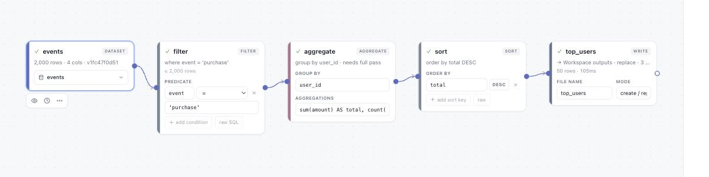

# Data Playground

[](https://github.com/pengw0048/data-playground/actions/workflows/ci.yml)
[](LICENSE)

Data Playground is a local-first workspace for ML researchers and data scientists who need to inspect, transform, and publish data without losing track of what ran on which input.

Use a visual Canvas to connect typed data operations, inspect the data that can be represented truthfully at each step, and run the same work over a full dataset. Workspaces keep the resulting datasets, revisions, runs, and outputs together.



## Start locally

Install [uv](https://docs.astral.sh/uv/) and [Node.js 20+](https://nodejs.org/), then run:

```bash
git clone https://github.com/pengw0048/data-playground.git
cd data-playground
make setup
make run
```

Open <http://127.0.0.1:8471>. The first run creates a local workspace and seeds `events.parquet`, `movies.csv`, and `images.parquet`; no cloud account or separate service is required.

## Follow one researcher loop

The seeded **Purchases per user** example is a complete first pass through the product:

1. **Find the input.** In **Workspace**, open `events` and inspect the dataset. Sources identify the input they use; adapters that expose immutable versions can also expose revision history.
2. **Make the work visible.** Choose **Open example Purchases per user**. Its Canvas connects `events` through a filter, aggregate, and sort to a **Write** card.
3. **Inspect before committing.** Preview a source or intermediate step to inspect rows and schema. A preview is bounded only when the operation can still be represented honestly; full-pass operations say so instead of presenting a misleading sample.
4. **Publish a result.** The example writes `top_users` to **Workspace outputs**. Press **Rerun all** to execute the full graph. A successful managed write records its output and, where the destination supports it, a published dataset revision and receipt.
5. **Let work finish in the background.** Use **Jobs**, Canvas run history, and **Inbox** to follow durable work and terminal outcomes rather than keeping the Canvas open.
6. **Reuse the evidence.** Reopen the Canvas, an admitted run input, or a published revision when you want to inspect, extend, or rerun the work.

For the click-by-click version, see the [Workspace-to-Canvas tour](docs/TUTORIAL.md). For the data and execution model behind this loop, see [Versioned data and durable execution](docs/VERSIONED_DATA_AND_DURABLE_EXECUTION.md).

## What this gives you

- **One workspace for data work.** Browse datasets, canvases, folders, and outputs in one place, with catalog search and lineage where the connected provider can supply them.
- **A typed, inspectable Canvas.** Build filters, joins, aggregates, SQL and Python transforms, validation checks, and writes with validated connections and saved graph state.
- **Previews that state their limits.** Sampling is useful only when it preserves the operation's meaning. Data Playground distinguishes that from work that needs a full pass.
- **Evidence for a run.** Runs record their inputs and outcomes; managed writes can publish receipts and dataset revisions. A newer catalog head does not rewrite the identity of a completed run.
- **Background execution you can return to.** Jobs, Canvas run history, and Inbox retain progress and terminal outcomes across ordinary UI navigation and service recovery.

## Extend without coupling the core to your stack

Data Playground's extension boundary is a Python plugin package. Plugins can add typed Canvas nodes, data adapters, catalog/search providers, destinations, execution backends, importers, viewers, and telemetry. The core stays useful with local files and embedded metadata; an integration owns the capabilities it adds and reports unsupported operations explicitly.

Start with [plugin onboarding](docs/PLUGIN_ONBOARDING.md) and the tested packages in [`examples/plugins/`](examples/plugins/). This is also the boundary for a team to connect its own catalog, scheduler, or compute system without adding provider-specific branches to the open-source core.

## Support boundary

Data Playground's supported baseline is a local workstation or a trusted shared team service. It is not a hostile multi-tenant isolation boundary: operators, installed plugins, workers, and people allowed to run arbitrary Python are trusted within a workspace. Optional distributed backends have their own documented support matrices.

Read the exact [support and trust boundary](docs/SUPPORT.md) before deploying beyond a local workspace. Report vulnerabilities through the [security policy](.github/SECURITY.md).

## Documentation

### Use

- [Workspace-to-Canvas tour](docs/TUTORIAL.md)
- [Catalog and discovery](docs/CATALOG.md)
- [Versioned data and durable execution](docs/VERSIONED_DATA_AND_DURABLE_EXECUTION.md)
- [Browser and viewport support](docs/BROWSER_SUPPORT.md)
- [MCP integration](docs/MCP.md)

### Extend

- [Plugin onboarding](docs/PLUGIN_ONBOARDING.md)
- [Plugin examples](examples/plugins/)
- [HTTP API contract](docs/API.md)
- [Kernel and API architecture](kernel/README.md)

### Operate

- [Support and deployment boundary](docs/SUPPORT.md)
- [Backup and restore](docs/BACKUP_RESTORE.md)
- [CI and test matrix](docs/CI.md)
- [Observability](docs/OBSERVABILITY.md)
- [UX acceptance](docs/UX_ACCEPTANCE.md)
- [Project acceptance and roadmap](docs/PROJECT_ACCEPTANCE_AND_ROADMAP.md)
- [Ray backend](docs/RAY.md) and [Ray Jobs](docs/RAY_JOBS.md)
- [Deployment reference](deploy/README.md)

## Contribute

See [CONTRIBUTING.md](.github/CONTRIBUTING.md). The project is licensed under [Apache 2.0](LICENSE).
